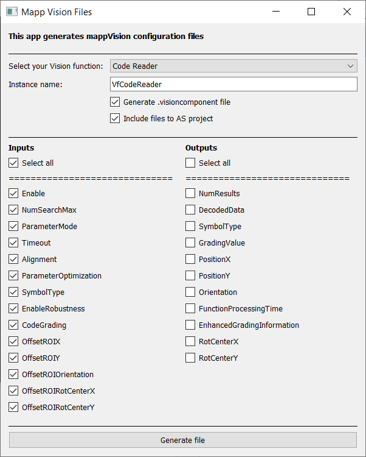

# PyVf

I made a simple Python app that generates mapp Vision configuration files (.visionapplication and .visioncomponent). Why? Because I found the process of creating these files manually in the AS a bit annoying - especially configuring the Vision function inputs and outputs. The source code is available at (https://gitlab.com/tomas.vostrel95/pyvf) - fell free to use and modify it. I'd be glad for any feedback.

## Requirements

- Mapp Vision V > 5.10
- Python 3.9.0 (can be downloaded from https://www.python.org/downloads/)
- PyQt5 (can be installed with "pip install pyqt5" command)

## Screenshot

